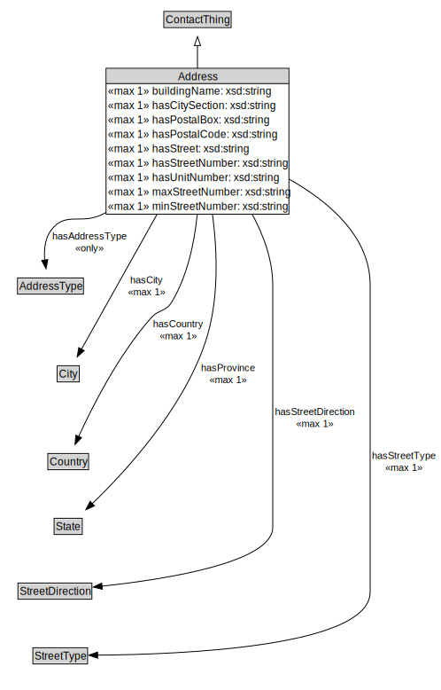

# Address

<a href="diagrams/Address.dot.svg">Open interactive Address diagram</a>

## Formalization for Address

| Property | Constraint |
|----------|------------|
| buildingName | max 1 owl:Thing |
| cdm1:hasLocation | max 1 owl:Thing |
| hasAddressType | all AddressType |
| hasCity | max 1 owl:Thing |
| hasCitySection | max 1 owl:Thing |
| hasCountry | max 1 owl:Thing |
| hasPostalBox | max 1 owl:Thing |
| hasPostalCode | max 1 owl:Thing |
| hasProvince | max 1 owl:Thing |
| hasStreet | max 1 owl:Thing |
| hasStreetDirection | max 1 owl:Thing |
| hasStreetNumber | max 1 owl:Thing |
| hasStreetType | max 1 owl:Thing |
| hasUnitNumber | max 1 owl:Thing |
| maxStreetNumber | max 1 owl:Thing |
| minStreetNumber | max 1 owl:Thing |
| subClassOf | ContactThing |

## Used by classes

| Class | Property |
|-------|----------|
| [Building Unit](BuildingUnit.md) | hasAddress |
| [Business Establishment](BusinessEstablishment.md) | hasAddress |
| [Infrastructure Element](InfrastructureElement.md) | hasAddress |
| [Organization](Organization.md) | orgAddress |
| [Person](Person.md) | hasAddress |

