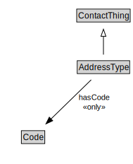

# AddressType

<a href="diagrams/AddressType.dot.svg">Open interactive AddressType diagram</a>

## Formalization for AddressType

| Property | Constraint |
|----------|------------|
| hasCode | all Code |
| subClassOf | ContactThing |

## Used by classes

| Class | Property |
|-------|----------|
| [Address](Address.md) | hasAddressType |

