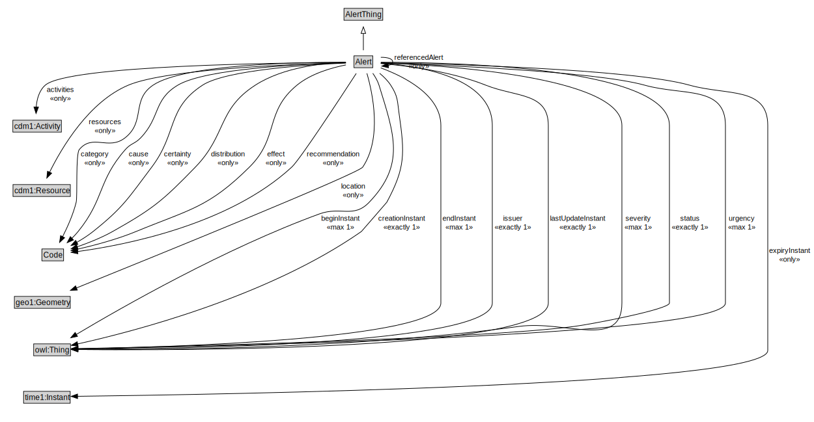

# Alert

An Alert can be used to notify people of important information.

<a href="diagrams/Alert.dot.svg">Open interactive Alert diagram</a>

## Formalization for Alert

| Property | Constraint |
|----------|------------|
| activities | all cdm1:Activity |
| beginInstant | max 1 owl:Thing |
| category | all Code |
| cause | all Code |
| cdm1:hasDescription | exactly 1 owl:Thing |
| certainty | all Code |
| creationInstant | exactly 1 owl:Thing |
| distribution | all Code |
| effect | all Code |
| endInstant | max 1 owl:Thing |
| expiryInstant | all time1:Instant |
| headline | exactly 1 owl:Thing |
| issuer | exactly 1 owl:Thing |
| lastUpdateInstant | exactly 1 owl:Thing |
| location | all geo1:Geometry |
| recommendation | all Code |
| referencedAlert | all Alert |
| resources | all cdm1:Resource |
| severity | max 1 owl:Thing |
| status | exactly 1 owl:Thing |
| subClassOf | AlertThing |
| urgency | max 1 owl:Thing |
| website | all xsd:anyURI |

## Used by classes

| Class | Property |
|-------|----------|
| [Alert](Alert.md) | referencedAlert |

