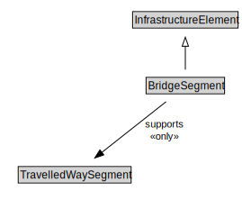

# BridgeSegment

<a href="diagrams/BridgeSegment.dot.svg">Open interactive BridgeSegment diagram</a>

## Formalization for BridgeSegment

| Property | Constraint |
|----------|------------|
| subClassOf | InfrastructureElement |
| supports | all TravelledWaySegment |

## Used by classes

| Class | Property |
|-------|----------|
| [Bridge](Bridge.md) | cdm1:hasProperPart |

