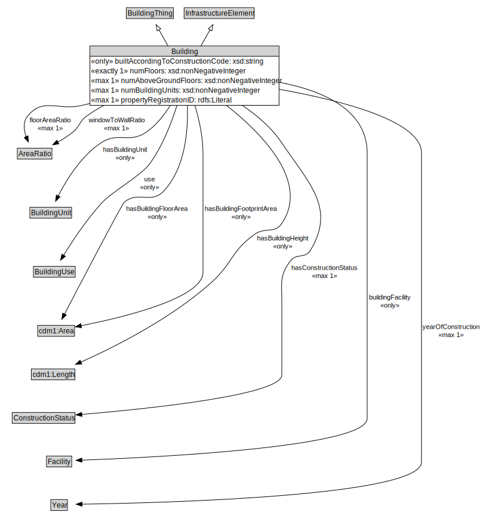

# Building

NOTE: There are different types (subclasses) of buildings; House, Apartment Building, Office Building...

<a href="diagrams/Building.dot.svg">Open interactive Building diagram</a>

## Formalization for Building

| Property | Constraint |
|----------|------------|
| buildingFacility | all Facility |
| builtAccordingToConstructionCode | all xsd:string |
| floorAreaRatio | max 1 owl:Thing |
| hasBuildingFloorArea | all cdm1:Area |
| hasBuildingFootprintArea | all cdm1:Area |
| hasBuildingHeight | all cdm1:Length |
| hasBuildingUnit | all BuildingUnit |
| hasConstructionStatus | max 1 owl:Thing |
| numAboveGroundFloors | max 1 owl:Thing |
| numBuildingUnits | max 1 owl:Thing |
| numFloors | exactly 1 owl:Thing |
| propertyRegistrationID | max 1 owl:Thing |
| subClassOf | InfrastructureElement |
| subClassOf | BuildingThing |
| use | all BuildingUse |
| windowToWallRatio | max 1 owl:Thing |
| yearOfConstruction | max 1 owl:Thing |

