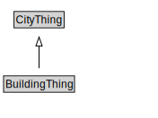

# BuildingThing

<a href="diagrams/BuildingThing.dot.svg">Open interactive BuildingThing diagram</a>

## Specializations of BuildingThing

| Class | Description |
|-------|-------------|
| [Area Ratio](AreaRatio.md) |  |
| [Building](Building.md) |  |
| [Building Unit](BuildingUnit.md) |  |
| [Building Use](BuildingUse.md) |  |
| [Construction Status](ConstructionStatus.md) |  |
| [Facility](Facility.md) |  |
| [Year](Year.md) |  |

## Formalization for BuildingThing

| Property | Constraint |
|----------|------------|
| subClassOf | CityThing |

