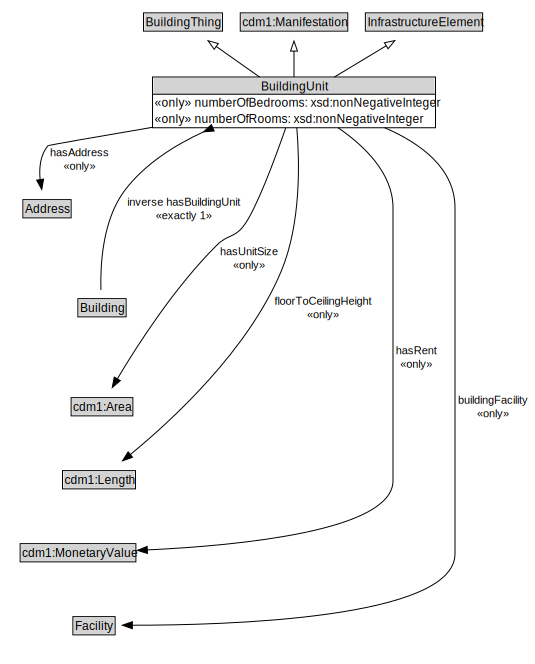

# BuildingUnit

<a href="diagrams/BuildingUnit.dot.svg">Open interactive BuildingUnit diagram</a>

## Formalization for BuildingUnit

| Property | Constraint |
|----------|------------|
| buildingFacility | all Facility |
| cdm1:existsAt | exactly 1 owl:Thing |
| floorToCeilingHeight | all cdm1:Length |
| hasAddress | all Address |
| hasRent | all cdm1:MonetaryValue |
| hasUnitSize | all cdm1:Area |
| i72:hasValue | all cdm1:MonetaryValue |
| inverse hasBuildingUnit | exactly 1 owl:Thing |
| numberOfBedrooms | all xsd:nonNegativeInteger |
| numberOfRooms | all xsd:nonNegativeInteger |
| subClassOf | BuildingThing |
| subClassOf | cdm1:Manifestation |
| subClassOf | InfrastructureElement |

## Used by classes

| Class | Property |
|-------|----------|
| [Building](Building.md) | hasBuildingUnit |

