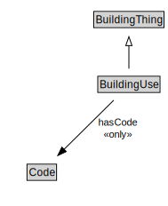

# BuildingUse

EXAMPLE: residential, commercial, industrial

<a href="diagrams/BuildingUse.dot.svg">Open interactive BuildingUse diagram</a>

## Formalization for BuildingUse

| Property | Constraint |
|----------|------------|
| hasCode | all Code |
| subClassOf | BuildingThing |

## Used by classes

| Class | Property |
|-------|----------|
| [Building](Building.md) | use |

