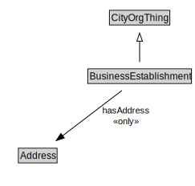

# BusinessEstablishment

<a href="diagrams/BusinessEstablishment.dot.svg">Open interactive BusinessEstablishment diagram</a>

## Formalization for BusinessEstablishment

| Property | Constraint |
|----------|------------|
| cdm1:hasLocation | max 1 owl:Thing |
| hasAddress | all Address |
| subClassOf | CityOrgThing |

## Used by classes

| Class | Property |
|-------|----------|
| [For Profit Organization](ForProfitOrganization.md) | hasEstablishment |

