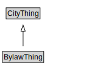

# BylawThing

<a href="diagrams/BylawThing.dot.svg">Open interactive BylawThing diagram</a>

## Specializations of BylawThing

| Class | Description |
|-------|-------------|
| [Amending Bylaw](AmendingBylaw.md) |  |
| [Bylaw](Bylaw.md) |  |
| [Clause](Clause.md) |  |
| [Definition](Definition.md) |  |
| [Law](Law.md) |  |
| [Main Bylaw](MainBylaw.md) |  |
| [Revision Bylaw](RevisionBylaw.md) |  |
| [Schedule](Schedule.md) |  |

## Formalization for BylawThing

| Property | Constraint |
|----------|------------|
| subClassOf | CityThing |

