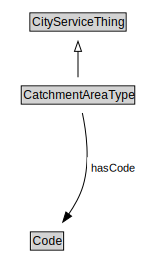

# CatchmentAreaType

<a href="diagrams/CatchmentAreaType.dot.svg">Open interactive CatchmentAreaType diagram</a>

## Formalization for CatchmentAreaType

| Property | Constraint |
|----------|------------|
| hasCode | all Code |
| subClassOf | CityServiceThing |

## Used by classes

| Class | Property |
|-------|----------|
| [Stakeholder](Stakeholder.md) | hasCatchmentAreaType |

