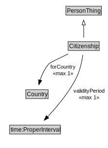

# Citizenship

<a href="diagrams/Citizenship.dot.svg">Open interactive Citizenship diagram</a>

## Formalization for Citizenship

| Property | Constraint |
|----------|------------|
| forCountry | max 1 owl:Thing |
| subClassOf | PersonThing |
| validityPeriod | max 1 owl:Thing |

## Used by classes

| Class | Property |
|-------|----------|
| [Person](Person.md) | citizenOf |

