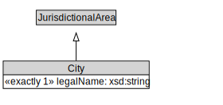

# City

<a href="diagrams/City.dot.svg">Open interactive City diagram</a>

## Formalization for City

| Property | Constraint |
|----------|------------|
| legalName | exactly 1 owl:Thing |
| subClassOf | JurisdictionalArea |

## Used by classes

| Class | Property |
|-------|----------|
| [City Administrative Area](CityAdministrativeArea.md) | administrativeAreaOf |

