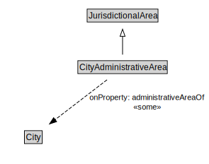

# CityAdministrativeArea

<a href="diagrams/CityAdministrativeArea.dot.svg">Open interactive CityAdministrativeArea diagram</a>

## Formalization for CityAdministrativeArea

| Property | Constraint |
|----------|------------|
| administrativeAreaOf | some City |
| subClassOf | JurisdictionalArea |

