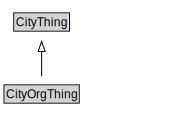

# CityOrgThing

<a href="diagrams/CityOrgThing.dot.svg">Open interactive CityOrgThing diagram</a>

## Specializations of CityOrgThing

| Class | Description |
|-------|-------------|
| [Business Establishment](BusinessEstablishment.md) |  |
| [Compensation](Compensation.md) |  |
| [Employment](Employment.md) |  |
| [Employment Status](EmploymentStatus.md) |  |
| [For Profit Organization](ForProfitOrganization.md) |  |
| [Goal](Goal.md) |  |
| [Government Organization](GovernmentOrganization.md) |  |
| [Industry Type](IndustryType.md) |  |
| [Non Profit Organization](NonProfitOrganization.md) |  |
| [Occupation](Occupation.md) |  |
| [Operation](Operation.md) |  |
| [Organization](Organization.md) |  |
| [Organization Agent](OrganizationAgent.md) |  |
| [Role](Role.md) |  |
| [Salary](Salary.md) |  |
| [Wage](Wage.md) |  |

## Formalization for CityOrgThing

| Property | Constraint |
|----------|------------|
| subClassOf | CityThing |

