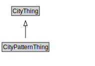

# CityPatternThing

<a href="diagrams/CityPatternThing.dot.svg">Open interactive CityPatternThing diagram</a>

## Specializations of CityPatternThing

| Class | Description |
|-------|-------------|
| [City](City.md) |  |
| [City Administrative Area](CityAdministrativeArea.md) |  |
| [Jurisdictional Area (TransportInfrastructurePattern)](JurisdictionalArea.md) |  |
| [Transport Infrastructure Thing](TransportInfrastructureThing.md) |  |

## Formalization for CityPatternThing

| Property | Constraint |
|----------|------------|
| subClassOf | CityThing |

