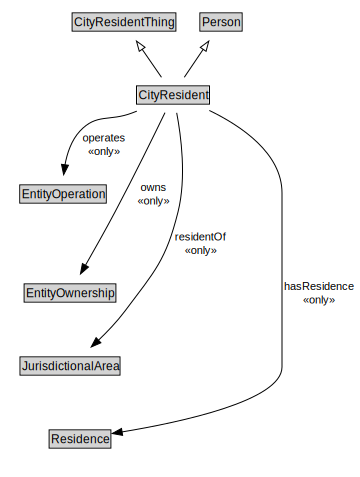

# CityResident

NOTE: Different cities have different definitions of who is that city's Resident, the City Resident Pattern contains the core properties required by each. For example, the city of Toronto's definition of a city resident includes the concept of owning property or owning or operating a business in the city. For Beijing, nationality is a unique aspect. Central to all the definitions is the concept of residing. 

<a href="diagrams/CityResident.dot.svg">Open interactive CityResident diagram</a>

## Formalization for CityResident

| Property | Constraint |
|----------|------------|
| hasResidence | all Residence |
| operates | all EntityOperation |
| owns | all EntityOwnership |
| residentOf | all JurisdictionalArea |
| subClassOf | CityResidentThing |
| subClassOf | Person |

