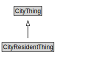

# CityResidentThing

<a href="diagrams/CityResidentThing.dot.svg">Open interactive CityResidentThing diagram</a>

## Specializations of CityResidentThing

| Class | Description |
|-------|-------------|
| [City Resident](CityResident.md) |  |
| [Controlled Entity](ControlledEntity.md) |  |
| [Entity Operation](EntityOperation.md) |  |
| [Entity Ownership](EntityOwnership.md) |  |
| [Home Type](HomeType.md) |  |
| [Residence](Residence.md) |  |
| [Residential Relationship](ResidentialRelationship.md) |  |

## Formalization for CityResidentThing

| Property | Constraint |
|----------|------------|
| subClassOf | CityThing |

