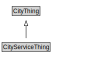

# CityServiceThing

<a href="diagrams/CityServiceThing.dot.svg">Open interactive CityServiceThing diagram</a>

## Specializations of CityServiceThing

| Class | Description |
|-------|-------------|
| [Catchment Area Type](CatchmentAreaType.md) |  |
| [Impact Direction](ImpactDirection.md) |  |
| [Importance](Importance.md) |  |
| [Input](Input.md) |  |
| [Outcome](Outcome.md) |  |
| [Output](Output.md) |  |
| [Program](Program.md) |  |
| [Service](Service.md) |  |
| [Stakeholder](Stakeholder.md) |  |

## Formalization for CityServiceThing

| Property | Constraint |
|----------|------------|
| subClassOf | CityThing |

