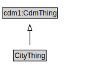

# CityThing

<a href="diagrams/CityThing.dot.svg">Open interactive CityThing diagram</a>

## Specializations of CityThing

| Class | Description |
|-------|-------------|
| [Address](Address.md) |  |
| [Alert](Alert.md) | An Alert can be used to notify people of important information. |
| [Alert Thing](AlertThing.md) |  |
| [Amending Bylaw](AmendingBylaw.md) |  |
| [Area Ratio](AreaRatio.md) |  |
| [Bridge](Bridge.md) |  |
| [Bridge Segment](BridgeSegment.md) |  |
| [Building](Building.md) |  |
| [Building](Building.md) |  |
| [Building Thing](BuildingThing.md) |  |
| [Building Unit](BuildingUnit.md) |  |
| [Building Unit](BuildingUnit.md) |  |
| [Building Use](BuildingUse.md) |  |
| [Business Establishment](BusinessEstablishment.md) |  |
| [Bylaw](Bylaw.md) |  |
| [Bylaw Thing](BylawThing.md) |  |
| [Catchment Area Type](CatchmentAreaType.md) |  |
| [Citizenship](Citizenship.md) |  |
| [City](City.md) |  |
| [City Administrative Area](CityAdministrativeArea.md) |  |
| [City Org Thing](CityOrgThing.md) |  |
| [City Pattern Thing](CityPatternThing.md) |  |
| [City Resident](CityResident.md) |  |
| [City Resident](CityResident.md) |  |
| [City Resident Thing](CityResidentThing.md) |  |
| [City Service Thing](CityServiceThing.md) |  |
| [Clause](Clause.md) |  |
| [Code](Code.md) |  |
| [Code Thing](CodeThing.md) |  |
| [Compensation](Compensation.md) |  |
| [Condition Precedent](ConditionPrecedent.md) |  |
| [Construction Status](ConstructionStatus.md) |  |
| [Contact Thing](ContactThing.md) |  |
| [Contract](Contract.md) |  |
| [Contract Thing](ContractThing.md) |  |
| [Contractual Commitment](ContractualCommitment.md) |  |
| [Contractual Definition](ContractualDefinition.md) |  |
| [Contractual Element](ContractualElement.md) |  |
| [Controlled Entity](ControlledEntity.md) |  |
| [Country](Country.md) |  |
| [Definition](Definition.md) |  |
| [Education](Education.md) |  |
| [Employment](Employment.md) |  |
| [Employment Status](EmploymentStatus.md) |  |
| [Entity Operation](EntityOperation.md) |  |
| [Entity Ownership](EntityOwnership.md) |  |
| [Facility](Facility.md) |  |
| [Facility](Facility.md) |  |
| [For Profit Organization](ForProfitOrganization.md) |  |
| [Gender](Gender.md) |  |
| [Goal](Goal.md) |  |
| [Government Organization](GovernmentOrganization.md) |  |
| [Home Type](HomeType.md) |  |
| [Household](Household.md) |  |
| [Household Thing](HouseholdThing.md) |  |
| [ID Type](IDType.md) |  |
| [Impact Direction](ImpactDirection.md) |  |
| [Importance](Importance.md) |  |
| [Industry Type](IndustryType.md) |  |
| [Infrastructure Element](InfrastructureElement.md) |  |
| [Infrastructure Thing](InfrastructureThing.md) |  |
| [Input](Input.md) |  |
| [Jurisdictional Area (TransportInfrastructurePattern)](JurisdictionalArea.md) |  |
| [Land Area](LandArea.md) |  |
| [Land Use Classification](LandUseClassification.md) |  |
| [Land Use Thing](LandUseThing.md) |  |
| [Law](Law.md) |  |
| [Main Bylaw](MainBylaw.md) |  |
| [Name](Name.md) |  |
| [Non Binding Term](NonBindingTerm.md) |  |
| [Non Profit Organization](NonProfitOrganization.md) |  |
| [Occupation](Occupation.md) |  |
| [Operation](Operation.md) |  |
| [Organization](Organization.md) |  |
| [Organization Agent](OrganizationAgent.md) |  |
| [Outcome](Outcome.md) |  |
| [Output](Output.md) |  |
| [Person](Person.md) |  |
| [Person Id](PersonId.md) |  |
| [Person Name](PersonName.md) |  |
| [Person Name](PersonName.md) |  |
| [Person Thing](PersonThing.md) |  |
| [Program](Program.md) |  |
| [Rail Line](RailLine.md) |  |
| [Rail Link](RailLink.md) |  |
| [Rail Segment](RailSegment.md) |  |
| [Representation](Representation.md) |  |
| [Residence](Residence.md) |  |
| [Residential Relationship](ResidentialRelationship.md) |  |
| [Revision Bylaw](RevisionBylaw.md) |  |
| [Road](Road.md) |  |
| [Road Link](RoadLink.md) |  |
| [Road Network Type](RoadNetworkType.md) |  |
| [Road Segment](RoadSegment.md) |  |
| [Role](Role.md) |  |
| [Salary](Salary.md) |  |
| [Schedule](Schedule.md) |  |
| [Service](Service.md) |  |
| [Sex](Sex.md) |  |
| [Skill](Skill.md) |  |
| [Stakeholder](Stakeholder.md) |  |
| [State](State.md) |  |
| [Transport Infrastructure Thing](TransportInfrastructureThing.md) |  |
| [Travelled Way](TravelledWay.md) |  |
| [Travelled Way Link](TravelledWayLink.md) |  |
| [Travelled Way Segment](TravelledWaySegment.md) |  |
| [Tunnel](Tunnel.md) |  |
| [Tunnel Segment](TunnelSegment.md) |  |
| [Wage](Wage.md) |  |
| [Warranty](Warranty.md) |  |
| [Year](Year.md) |  |

## Formalization for CityThing

| Property | Constraint |
|----------|------------|
| subClassOf | cdm1:CdmThing |

