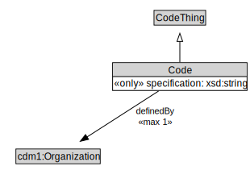

# Code

<a href="diagrams/Code.dot.svg">Open interactive Code diagram</a>

## Formalization for Code

| Property | Constraint |
|----------|------------|
| cdm1:hasDescription | all xsd:string |
| cdm1:hasIdentifier | max 1 owl:Thing |
| cdm1:hasName | all xsd:string |
| definedBy | max 1 owl:Thing |
| specification | all xsd:string |
| subClassOf | CodeThing |

## Used by classes

| Class | Property |
|-------|----------|
| [Alert](Alert.md) | category |
| [Alert](Alert.md) | cause |
| [Alert](Alert.md) | certainty |
| [Alert](Alert.md) | distribution |
| [Alert](Alert.md) | effect |
| [Alert](Alert.md) | recommendation |
| [Building Use](BuildingUse.md) | hasCode |
| [Catchment Area Type](CatchmentAreaType.md) | hasCode |
| [Construction Status](ConstructionStatus.md) | hasCode |
| [Country](Country.md) | hasCode |
| [Education](Education.md) | hasCode |
| [Employment Status](EmploymentStatus.md) | hasCode |
| [Gender](Gender.md) | hasCode |
| [Home Type](HomeType.md) | hasCode |
| [ID Type](IDType.md) | hasCode |
| [Impact Direction](ImpactDirection.md) | hasCode |
| [Importance](Importance.md) | hasCode |
| [Industry Type](IndustryType.md) | hasCode |
| [Land Use Classification](LandUseClassification.md) | hasCode |
| [Occupation](Occupation.md) | hasCode |
| [Residential Relationship](ResidentialRelationship.md) | hasCode |
| [Road Network Type](RoadNetworkType.md) | hasCode |
| [Sex](Sex.md) | hasCode |
| [Skill](Skill.md) | hasCode |
| [State](State.md) | hasCode |

