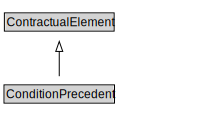

# ConditionPrecedent

<a href="diagrams/ConditionPrecedent.dot.svg">Open interactive ConditionPrecedent diagram</a>

## Formalization for ConditionPrecedent

| Property | Constraint |
|----------|------------|
| subClassOf | ContractualElement |

