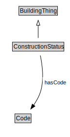

# ConstructionStatus

<a href="diagrams/ConstructionStatus.dot.svg">Open interactive ConstructionStatus diagram</a>

## Formalization for ConstructionStatus

| Property | Constraint |
|----------|------------|
| hasCode | all Code |
| subClassOf | BuildingThing |

