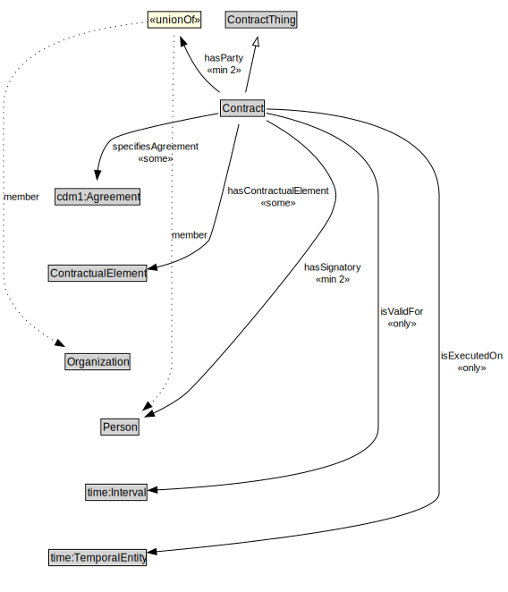

# Contract

<a href="diagrams/Contract.dot.svg">Open interactive Contract diagram</a>

## Formalization for Contract

| Property | Constraint |
|----------|------------|
| hasContractualElement | some ContractualElement |
| hasParty | min 2 owl:Thing |
| hasSignatory | min 2 owl:Thing |
| isExecutedOn | all time:TemporalEntity |
| isValidFor | all time:Interval |
| specifiesAgreement | some cdm1:Agreement |
| subClassOf | ContractThing |

## Used by classes

| Class | Property |
|-------|----------|
| [Contractual Element](ContractualElement.md) | Nd60714e41d7c4197827199e7d806e909 |

