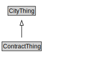

# ContractThing

<a href="diagrams/ContractThing.dot.svg">Open interactive ContractThing diagram</a>

## Specializations of ContractThing

| Class | Description |
|-------|-------------|
| [Condition Precedent](ConditionPrecedent.md) |  |
| [Contract](Contract.md) |  |
| [Contractual Commitment](ContractualCommitment.md) |  |
| [Contractual Definition](ContractualDefinition.md) |  |
| [Contractual Element](ContractualElement.md) |  |
| [Non Binding Term](NonBindingTerm.md) |  |
| [Representation](Representation.md) |  |
| [Warranty](Warranty.md) |  |

## Formalization for ContractThing

| Property | Constraint |
|----------|------------|
| subClassOf | CityThing |

