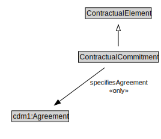

# ContractualCommitment

<a href="diagrams/ContractualCommitment.dot.svg">Open interactive ContractualCommitment diagram</a>

## Formalization for ContractualCommitment

| Property | Constraint |
|----------|------------|
| specifiesAgreement | all cdm1:Agreement |
| subClassOf | ContractualElement |

