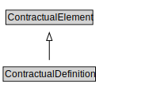

# ContractualDefinition

<a href="diagrams/ContractualDefinition.dot.svg">Open interactive ContractualDefinition diagram</a>

## Formalization for ContractualDefinition

| Property | Constraint |
|----------|------------|
| subClassOf | ContractualElement |

