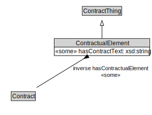

# ContractualElement

<a href="diagrams/ContractualElement.dot.svg">Open interactive ContractualElement diagram</a>

## Specializations of ContractualElement

| Class | Description |
|-------|-------------|
| [Condition Precedent](ConditionPrecedent.md) |  |
| [Contractual Commitment](ContractualCommitment.md) |  |
| [Contractual Definition](ContractualDefinition.md) |  |
| [Non Binding Term](NonBindingTerm.md) |  |
| [Representation](Representation.md) |  |
| [Warranty](Warranty.md) |  |

## Formalization for ContractualElement

| Property | Constraint |
|----------|------------|
| hasContractText | some xsd:string |
| inverse hasContractualElement | some Contract |
| subClassOf | ContractThing |

## Used by classes

| Class | Property |
|-------|----------|
| [Contract](Contract.md) | hasContractualElement |

