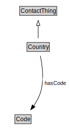

# Country

<a href="diagrams/Country.dot.svg">Open interactive Country diagram</a>

## Formalization for Country

| Property | Constraint |
|----------|------------|
| hasCode | all Code |
| subClassOf | ContactThing |

