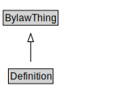

# Definition

<a href="diagrams/Definition.dot.svg">Open interactive Definition diagram</a>

## Formalization for Definition

| Property | Constraint |
|----------|------------|
| cdm1:hasDescription | max 1 owl:Thing |
| cdm1:hasName | max 1 owl:Thing |
| cdm1:properPartOf | exactly 1 owl:Thing |
| subClassOf | BylawThing |

## Used by classes

| Class | Property |
|-------|----------|
| [Law](Law.md) | hasDefinition |

