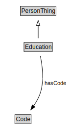

# Education

<a href="diagrams/Education.dot.svg">Open interactive Education diagram</a>

## Formalization for Education

| Property | Constraint |
|----------|------------|
| hasCode | all Code |
| subClassOf | PersonThing |

## Used by classes

| Class | Property |
|-------|----------|
| [Person](Person.md) | hasEducation |

