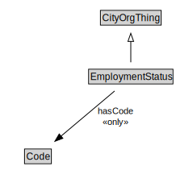

# EmploymentStatus

<a href="diagrams/EmploymentStatus.dot.svg">Open interactive EmploymentStatus diagram</a>

## Formalization for EmploymentStatus

| Property | Constraint |
|----------|------------|
| hasCode | all Code |
| subClassOf | CityOrgThing |

## Used by classes

| Class | Property |
|-------|----------|
| [Employment](Employment.md) | hasEmploymentStatus |

