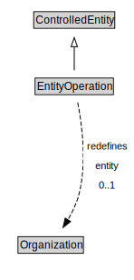

# EntityOperation

<a href="diagrams/EntityOperation.dot.svg">Open interactive EntityOperation diagram</a>

## Formalization for EntityOperation

| Property | Constraint |
|----------|------------|
| entity | max 1 owl:Thing |
| subClassOf | ControlledEntity |

## Used by classes

| Class | Property |
|-------|----------|
| [City Resident](CityResident.md) | operates |

