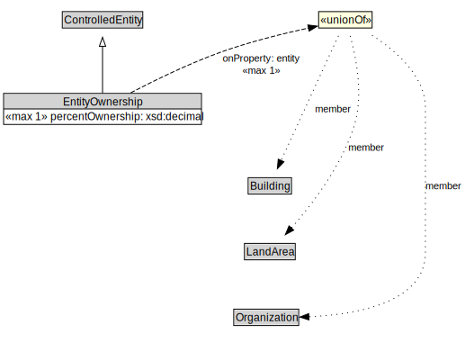

# EntityOwnership

<a href="diagrams/EntityOwnership.dot.svg">Open interactive EntityOwnership diagram</a>

## Formalization for EntityOwnership

| Property | Constraint |
|----------|------------|
| entity | max 1 owl:Thing |
| percentOwnership | max 1 owl:Thing |
| subClassOf | ControlledEntity |

## Used by classes

| Class | Property |
|-------|----------|
| [City Resident](CityResident.md) | owns |

