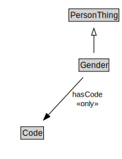

# Gender

<a href="diagrams/Gender.dot.svg">Open interactive Gender diagram</a>

## Formalization for Gender

| Property | Constraint |
|----------|------------|
| hasCode | all Code |
| subClassOf | PersonThing |

## Used by classes

| Class | Property |
|-------|----------|
| [Person](Person.md) | hasGenderIdentity |

