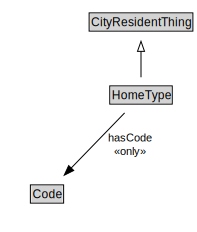

# HomeType

<a href="diagrams/HomeType.dot.svg">Open interactive HomeType diagram</a>

## Formalization for HomeType

| Property | Constraint |
|----------|------------|
| hasCode | all Code |
| subClassOf | CityResidentThing |

