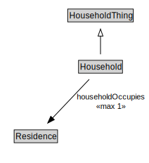

# Household

NOTE: More precise definitions of Household may be adopted as required for different contexts and applications through extensions to this class.

<a href="diagrams/Household.dot.svg">Open interactive Household diagram</a>

## Formalization for Household

| Property | Constraint |
|----------|------------|
| householdOccupies | max 1 owl:Thing |
| org:hasMember | all Person |
| subClassOf | HouseholdThing |
| time:hasTime | all time:ProperInterval |

