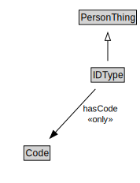

# IDType

<a href="diagrams/IDType.dot.svg">Open interactive IDType diagram</a>

## Formalization for IDType

| Property | Constraint |
|----------|------------|
| hasCode | all Code |
| subClassOf | PersonThing |

## Used by classes

| Class | Property |
|-------|----------|
| [Person Id](PersonId.md) | hasIDType |

