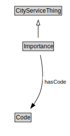

# Importance

<a href="diagrams/Importance.dot.svg">Open interactive Importance diagram</a>

## Formalization for Importance

| Property | Constraint |
|----------|------------|
| hasCode | all Code |
| subClassOf | CityServiceThing |

