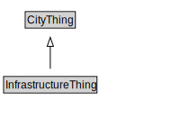

# InfrastructureThing

<a href="diagrams/InfrastructureThing.dot.svg">Open interactive InfrastructureThing diagram</a>

## Specializations of InfrastructureThing

| Class | Description |
|-------|-------------|
| [Bridge](Bridge.md) |  |
| [Bridge Segment](BridgeSegment.md) |  |
| [Building](Building.md) |  |
| [Building Unit](BuildingUnit.md) |  |
| [Facility](Facility.md) |  |
| [Infrastructure Element](InfrastructureElement.md) |  |
| [Rail Line](RailLine.md) |  |
| [Rail Link](RailLink.md) |  |
| [Rail Segment](RailSegment.md) |  |
| [Road](Road.md) |  |
| [Road Link](RoadLink.md) |  |
| [Road Network Type](RoadNetworkType.md) |  |
| [Road Segment](RoadSegment.md) |  |
| [Travelled Way](TravelledWay.md) |  |
| [Travelled Way Link](TravelledWayLink.md) |  |
| [Travelled Way Segment](TravelledWaySegment.md) |  |
| [Tunnel](Tunnel.md) |  |
| [Tunnel Segment](TunnelSegment.md) |  |

## Formalization for InfrastructureThing

| Property | Constraint |
|----------|------------|
| subClassOf | CityThing |

