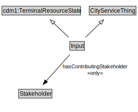

# Input

<a href="diagrams/Input.dot.svg">Open interactive Input diagram</a>

## Formalization for Input

| Property | Constraint |
|----------|------------|
| cdm1:hasDescription | all xsd:string |
| cdm1:hasName | max 1 owl:Thing |
| hasContributingStakeholder | all Stakeholder |
| i72:for_time_interval | all time:DateTimeInterval |
| subClassOf | CityServiceThing |
| subClassOf | cdm1:TerminalResourceState |

## Used by classes

| Class | Property |
|-------|----------|
| [Program](Program.md) | hasInput |
| [Service](Service.md) | hasInput |

