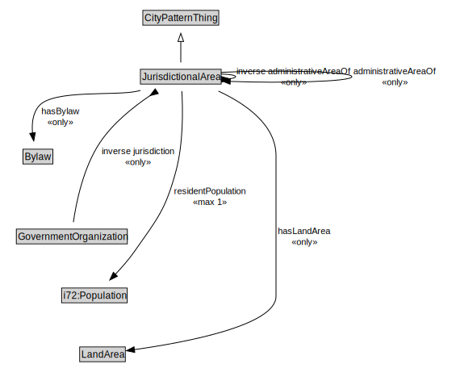

# JurisdictionalArea

<a href="diagrams/JurisdictionalArea.dot.svg">Open interactive JurisdictionalArea diagram</a>

## Specializations of JurisdictionalArea

| Class | Description |
|-------|-------------|
| [City](City.md) |  |
| [City Administrative Area](CityAdministrativeArea.md) |  |

## Formalization for JurisdictionalArea

| Property | Constraint |
|----------|------------|
| administrativeAreaOf | all JurisdictionalArea |
| cdm1:hasName | max 1 owl:Thing |
| hasBylaw | all Bylaw |
| hasLandArea | all LandArea |
| inverse administrativeAreaOf | all JurisdictionalArea |
| inverse jurisdiction | all GovernmentOrganization |
| residentPopulation | max 1 owl:Thing |
| subClassOf | CityPatternThing |

## Used by classes

| Class | Property |
|-------|----------|
| [City Resident](CityResident.md) | residentOf |
| [Government Organization](GovernmentOrganization.md) | jurisdiction |
| [Jurisdictional Area (TransportInfrastructurePattern)](JurisdictionalArea.md) | administrativeArea |
| [Jurisdictional Area (TransportInfrastructurePattern)](JurisdictionalArea.md) | administrativeAreaOf |

