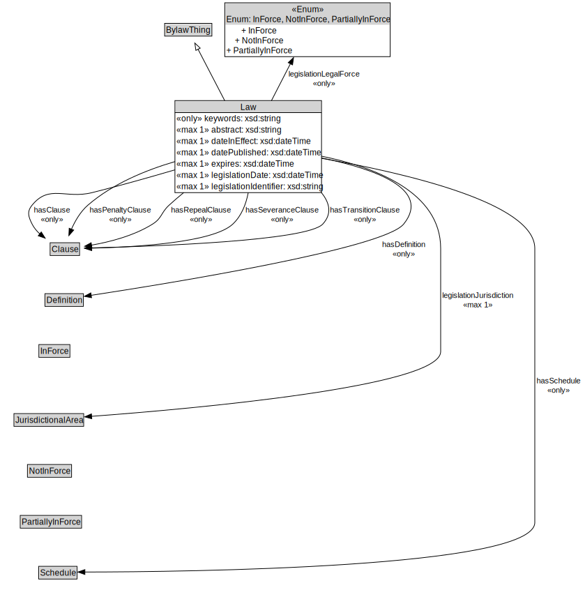

# Law

<a href="diagrams/Law.dot.svg">Open interactive Law diagram</a>

## Specializations of Law

| Class | Description |
|-------|-------------|
| [Amending Bylaw](AmendingBylaw.md) |  |
| [Bylaw](Bylaw.md) |  |
| [Main Bylaw](MainBylaw.md) |  |
| [Revision Bylaw](RevisionBylaw.md) |  |

## Formalization for Law

| Property | Constraint |
|----------|------------|
| abstract | max 1 owl:Thing |
| cdm1:hasName | all xsd:string |
| dateInEffect | max 1 owl:Thing |
| datePublished | max 1 owl:Thing |
| expires | max 1 owl:Thing |
| hasClause | all Clause |
| hasDefinition | all Definition |
| hasPenaltyClause | all Clause |
| hasRepealClause | all Clause |
| hasSchedule | all Schedule |
| hasSeveranceClause | all Clause |
| hasTransitionClause | all Clause |
| keywords | all xsd:string |
| legislationDate | max 1 owl:Thing |
| legislationIdentifier | max 1 owl:Thing |
| legislationJurisdiction | max 1 owl:Thing |
| legislationLegalForce | all Enum: InForce, NotInForce, PartiallyInForce |
| subClassOf | BylawThing |

