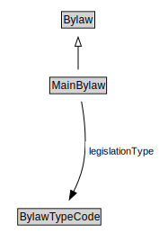

# MainBylaw

<a href="diagrams/MainBylaw.dot.svg">Open interactive MainBylaw diagram</a>

## Formalization for MainBylaw

| Property | Constraint |
|----------|------------|
| legislationType | has mainBylaw |
| subClassOf | Bylaw |

