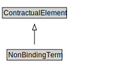

# NonBindingTerm

<a href="diagrams/NonBindingTerm.dot.svg">Open interactive NonBindingTerm diagram</a>

## Formalization for NonBindingTerm

| Property | Constraint |
|----------|------------|
| subClassOf | ContractualElement |

