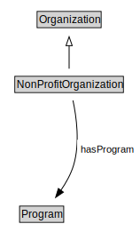

# NonProfitOrganization

<a href="diagrams/NonProfitOrganization.dot.svg">Open interactive NonProfitOrganization diagram</a>

## Formalization for NonProfitOrganization

| Property | Constraint |
|----------|------------|
| hasProgram | all Program |
| subClassOf | Organization |

