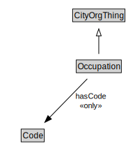

# Occupation

EXAMPLE: sales, skilled trade

<a href="diagrams/Occupation.dot.svg">Open interactive Occupation diagram</a>

## Formalization for Occupation

| Property | Constraint |
|----------|------------|
| hasCode | all Code |
| subClassOf | CityOrgThing |

## Used by classes

| Class | Property |
|-------|----------|
| [Employment](Employment.md) | employedAs |

