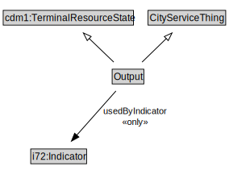

# Output

EXAMPLE: produced 100 meals for the homeless

<a href="diagrams/Output.dot.svg">Open interactive Output diagram</a>

## Formalization for Output

| Property | Constraint |
|----------|------------|
| cdm1:hasDescription | all xsd:string |
| cdm1:hasName | max 1 owl:Thing |
| subClassOf | CityServiceThing |
| subClassOf | cdm1:TerminalResourceState |
| usedByIndicator | all i72:Indicator |

## Used by classes

| Class | Property |
|-------|----------|
| [Program](Program.md) | hasOutput |
| [Service](Service.md) | hasOutput |

