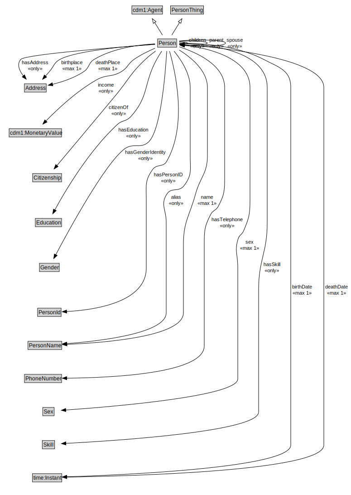

# Person

NOTE: Some properties are not defined in the Person ontology, but in an extension of the Person ontology that captures the interaction between iCity domain ontologies (e.g. Persons and their Vehicles)

<a href="diagrams/Person.dot.svg">Open interactive Person diagram</a>

## Specializations of Person

| Class | Description |
|-------|-------------|
| [City Resident](CityResident.md) |  |

## Formalization for Person

| Property | Constraint |
|----------|------------|
| alias | all PersonName |
| birthDate | max 1 owl:Thing |
| birthplace | max 1 owl:Thing |
| children | all Person |
| citizenOf | all Citizenship |
| deathDate | max 1 owl:Thing |
| deathPlace | max 1 owl:Thing |
| hasAddress | all Address |
| hasEducation | all Education |
| hasEmail | all EmailAddress |
| hasGenderIdentity | all Gender |
| hasPersonID | all PersonId |
| hasSkill | all Skill |
| hasTelephone | all PhoneNumber |
| income | all cdm1:MonetaryValue |
| name | max 1 owl:Thing |
| parent | all Person |
| sex | max 1 owl:Thing |
| spouse | all Person |
| subClassOf | PersonThing |
| subClassOf | cdm1:Agent |

## Used by classes

| Class | Property |
|-------|----------|
| [Household](Household.md) | org:hasMember |
| [Person](Person.md) | children |
| [Person](Person.md) | parent |
| [Person](Person.md) | spouse |

