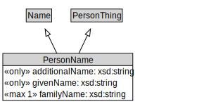

# PersonName

<a href="diagrams/PersonName.dot.svg">Open interactive PersonName diagram</a>

## Formalization for PersonName

| Property | Constraint |
|----------|------------|
| additionalName | all xsd:string |
| familyName | max 1 owl:Thing |
| givenName | all xsd:string |
| subClassOf | Name |
| subClassOf | PersonThing |

## Used by classes

| Class | Property |
|-------|----------|
| [Person](Person.md) | alias |

